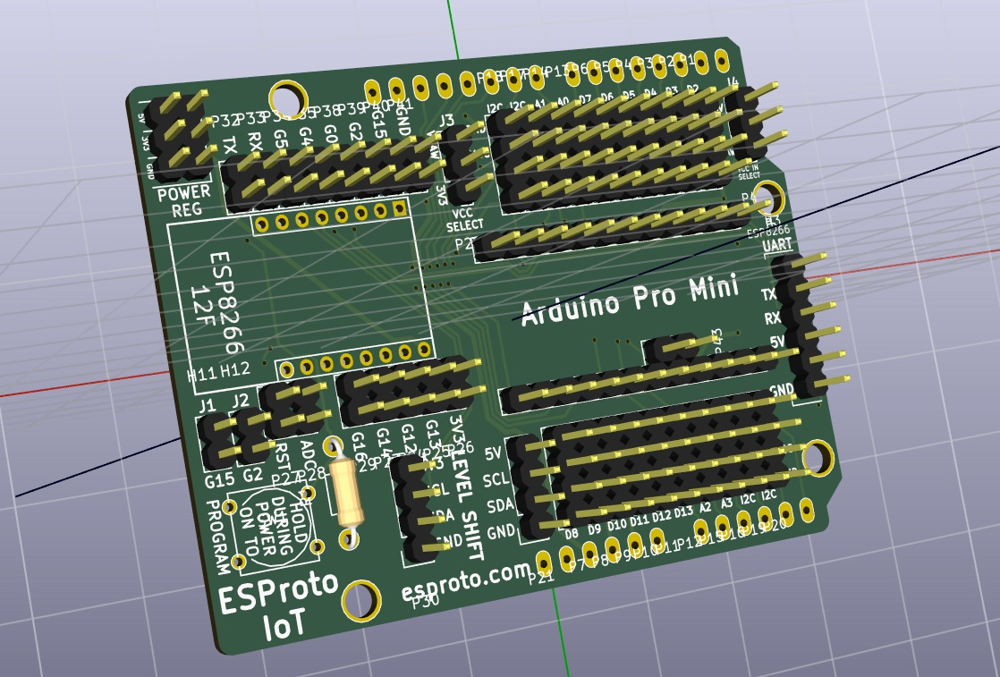
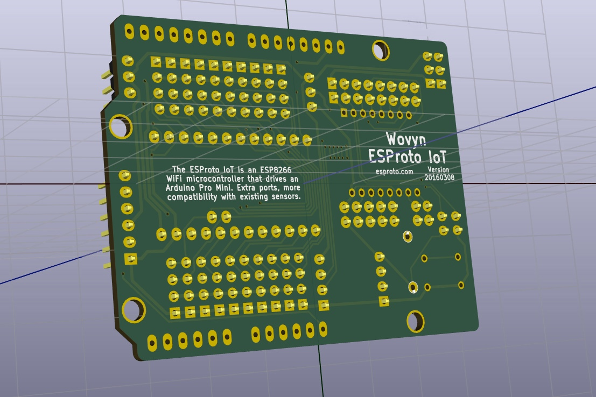

# ESProto-IoT

The ESProto IoT is an ESP8266 prototyping PCB made for the AI Thinker ESP-12F modules, and designed to support IoT ("Internet of Things") sensors and peripherals from SeeedStudio/Grove, DFRobot, and ControlEverything.

## How does it work?

The ESP8266 is more powerful than the Arduino Pro Mini--so why not use it as the "main" microcontroller, and drive the Arduino Pro Mini as a peripheral? We do that by communicating with the Arduino Pro Mini over I2C ("I-squared-C"). The advantage to this arrangement is a board that can speak to all of the 5V sensors and actuators that already work with your Arduino, with the added speed and WiFi capability of the ESP8266.

## Design Images

## PDFs

[View PDFs](Docs/PDF)
