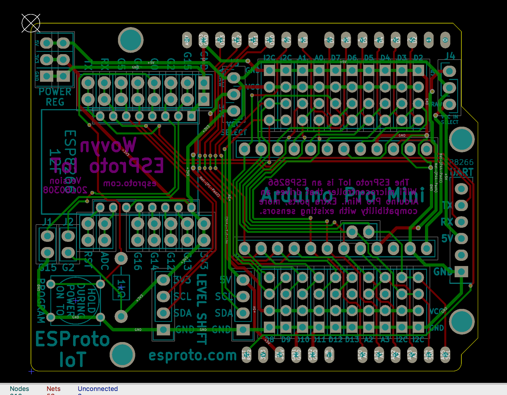

# ESProto-IoT
The ESProto IoT is a ESP-8266 prototyping PCB made for the AI Thinker ESP-12F modules, and designed to support IoT sensors and peripherals from SeeedStudio/Grove, DFRobot, and ControlEverything.

## Design Images

